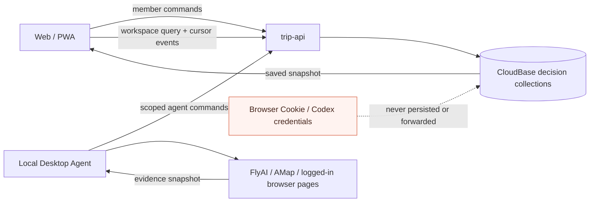
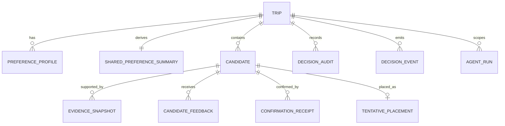
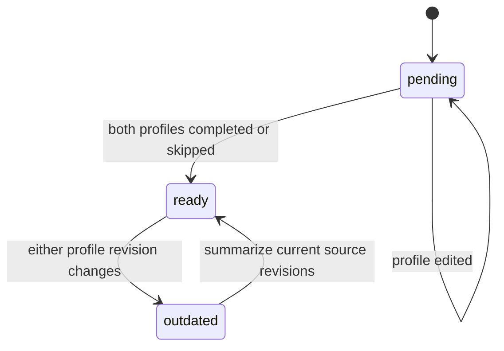
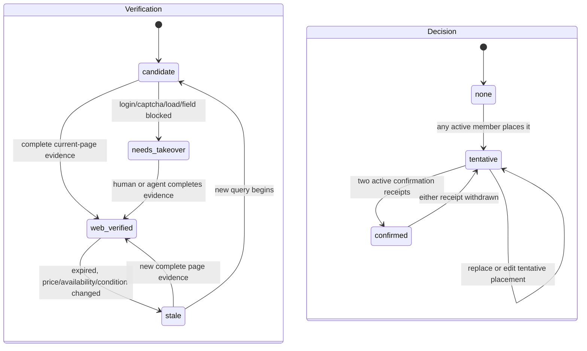

# Architecture Spine — 双人 Agent 决策层

## Design Paradigm

**命令查询分离（CQS）+ 证据不可变追加 + 资源级乐观并发。**

- 读取：前端只通过 `trip-api` 的决策工作区查询和游标事件流读取；PWA 缓存最后成功读取的工作区快照。decision collections 不向客户端开放直接读取。
- 写入：所有人和 Agent 的写入都经 `trip-api` 命令，数据库规则保持 `write: false`。
- 事实：一次查询或网页核验产生新的 `EvidenceSnapshot`；旧快照不被原地覆盖。
- 决策：偏好、反馈、状态变化各是独立资源，携带自己的 `revision`，不与既有整份 `Trip.version` 竞争。



## Existing Surface Ratified

- `packages/contracts` currently owns `TripSchema` and `TripRepository`; `saveTrip` updates one complete trip against `Trip.version`.
- `functions/trip-api` gets the caller identity from CloudBase runtime, uses transactions, has request idempotency for `saveTrip`, and records generic trip audits.
- `cloudbase/database.rules.json` currently grants direct reads to documents with `memberUids` and denies direct writes. 新 decision collections 不写 `memberUids`，因此该现有规则对其直接读取为 false；唯一读路径是服务端验证成员身份后的 `trip-api`。
- This spine adds a **parallel decision workspace** and a new repository contract. It does not change `TripSchema`, `TripRepository`, existing visual components, existing static place/hotel content, deployment, or secrets.

## Invariants & Rules

### AD-1 — 独立的决策工作区，而非扩展整份 Trip  [ADOPTED]

- **Binds:** FR-1, FR-2, FR-3, FR-4, FR-5, FR-8, NFR 并发一致性；`packages/contracts`、`functions/trip-api`。
- **Prevents:** 问卷编辑、反馈和 Agent 候选写回通过 `saveTrip` 争抢同一 `Trip.version`，导致整份旅行计划被静默覆盖。
- **Rule:** 为每个 `tripId` 创建逻辑上的 `DecisionWorkspace`，由下列独立资源组成。每个可变资源都有 `revision`；命令只更新其目标资源并在同一事务中写审计与 workspace event。`TentativePlacement` 先独立保存；只有 `attachTentativeToLegacyTrip` 可在同一 CloudBase transaction 中同时改变 placement 和既有 `Trip`。禁止前端把二者分别调用 `placeTentative` 与既有 `saveTrip` 后假定它们一致。

### AD-2 — 证据与推荐、用户决策分开建模  [ADOPTED]

- **Binds:** FR-3, FR-4, FR-6, FR-7, FR-8, FR-9。
- **Prevents:** 把聚合搜索结果当成网页真相，或把 `web_verified`、`tentative`、`confirmed` 混成一个不可审计状态。
- **Rule:** `Candidate` 保存推荐与当前决策；`EvidenceSnapshot` 保存一次来源事实；`verificationState` 和 `decisionState` 是两个正交字段。动态字段（价格、库存、营业、路线）只可来自证据快照，UI 必须显示来源和 `capturedAt`。任何状态降级都保留旧快照及原因，绝不平均冲突价格。

### AD-3 — 摘要是可再生派生物，不是偏好的所有者

- **Binds:** FR-1, FR-2, FR-3, FR-5。
- **Prevents:** Agent 或客户端把共同摘要当作真源，在问卷变更后丢失个人立场或反向覆盖暂定计划。
- **Rule:** 每位成员对自己的 `PreferenceProfile` 是唯一写者；`SharedPreferenceSummary` 必须引用其输入偏好 revision。仅两人均 `completed` 或 `skipped` 时可生成；任一偏好改变会标为 `outdated`，但不会改动 `Candidate`、`decisionState` 或既有行程。

### AD-4 — 最终确认由两份人类回执派生

- **Binds:** FR-5, FR-6, FR-8。
- **Prevents:** 单方、Agent 或竞态请求把候选自动最终确认；确认回退后不知是谁、为什么改变。
- **Rule:** 任一活跃成员可将候选设为 `tentative`。`confirmed` 不是任意写入值：只有当前两名 `memberUids` 都存在未撤回的 `ConfirmationReceipt` 时由服务端派生。任一成员撤回自己的回执，服务端把 `confirmed` 回退为 `tentative`。Agent 永远无此命令权限。

### AD-5 — Agent 写回使用本机密钥声明，不传递 bearer 凭据

- **Binds:** FR-3, FR-4, FR-6, FR-7, FR-9，安全与交易约束。
- **Prevents:** Desktop Agent 复用前端登录态、持有广泛服务密钥、写入其他旅行、修改人类决策，或把 Cookie/Codex 凭据写入共享库。
- **Rule:** 使用以下固定四步协议，且协议中没有 bearer token：
  1. Local Bridge 在 `127.0.0.1` 的随机端口生成一次性 **P-256 / ES256** 签名密钥对和 32-byte `pairingCode`，以人工确认或仅本机 loopback 方式把公钥与 code 指纹提供给前端。Bridge 的领取端点要求该 pairing code 且只接受已配置应用 origin 的请求。
  2. 已登录成员调用 `createAgentRun({ tripId, publicKeyJwk, pairingCodeHash: SHA-256(pairingCode), scope })`；服务端验证成员后只保存公钥、code hash、范围、状态 `pending_claim`、15 分钟过期时间和 `agentRunId`。响应仅含非机密 `agentRunId`。
  3. 前端在用户确认后只把 `agentRunId` 送至 `127.0.0.1` Bridge。Bridge 调用 `claimAgentRun({ agentRunId, pairingCode, clientNonce, signature })`；`signature` 为 `ES256(canonicalJson({agentRunId,pairingCode,clientNonce}))` 的 base64url 结果。服务端同时验证未使用的 code hash、公钥签名、过期与 `pending_claim`，原子地消耗 code、保存 `clientNonce` 并把状态改为 `claimed`。没有私钥的浏览器不能完成此步。
  4. Bridge 每次调用 `agentCommand` 都以同一 ES256 规则签名 `{ agentRunId, sequence, idempotencyKey, action, payload }`。服务端要求 `sequence === lastSequence + 1`，验证签名、运行状态、范围和幂等键，再在同一事务递增 `lastSequence`、执行命令、写 event/audit。重试复用相同 idempotency key 与 sequence 时只重放原响应；其他 sequence 重用一律拒绝。

  Agent 只能读取该旅行已公开的决策上下文，并调用 `submitProposalBatch`、`appendEvidenceSnapshot`、`reportVerificationBlocked`。`revokeAgentRun` 立即把状态改为 `revoked`；运行过期或批次完成后拒绝写回。禁止交易命令和任何 Cookie、验证码、账户资料、Codex 凭据进入 API payload、日志、审计或 CloudBase。

### AD-6 — 幂等与冲突必须返回可恢复的事实

- **Binds:** FR-1, FR-2, FR-5, FR-8，NFR 并发一致性。
- **Prevents:** 网络重试生成重复反馈/证据，或前端以“最后写入者获胜”掩盖双方编辑冲突。
- **Rule:** 每个写命令带 `idempotencyKey`、`expectedRevision` 和不可变请求体。幂等记录按 `(actor scope, command, idempotencyKey)` 唯一；相同规范化请求返回原成功结果，不同请求复用同一键返回 `IDEMPOTENCY_KEY_REUSED`。revision 不同返回 `VERSION_CONFLICT`，并携带目标资源的最新值与 revision；客户端显示可见冲突，或仅将自己尚未重叠的字段重新提交，不能静默覆盖。

### AD-7 — Decision collections 为服务端私有，审计不可改

- **Binds:** FR-2, FR-4, FR-5, FR-8, FR-9，CloudBase ACL。
- **Prevents:** 子集合复制过期 ACL、客户端直写伪造证据或历史状态被改写。
- **Rule:** 所有 decision collections（含 events、audits、Agent Runs）不带 `memberUids`，并保持当前规则下不可被浏览器直接读取或写入。`trip-api` 的每个 workspace query、event poll 和成员命令都在服务端读取当前 `Trip.memberUids` 及成员状态；`getDecisionEvents` 在打开、每次返回事件和结束长轮询前重复此检查。成员移除后下一次读或正在等待的长轮询都返回 `MEMBERSHIP_REQUIRED`，客户端随即清除本地决策缓存。每个状态改变命令必须在同一 transaction 写不可变 `DecisionAudit` 和 `DecisionEvent`。Agent Run 的公钥、code hash、nonce 与挑战绝不出现在工作区响应。

### AD-8 — PWA 只承诺已保存快照

- **Binds:** FR-4, FR-6, FR-7, FR-9。
- **Prevents:** Desktop 关闭后仍显示“实时”、或手机端依赖 Agent/网页访问才能打开旅行计划。
- **Rule:** `DecisionWorkspaceRepository` 在成功读取或实时更新后缓存可渲染快照。离线时只显示缓存，且对动态证据标记“最后核验时间”；不会自行刷新、不会调用本地 Agent、不会把过期快照误报为实时数据。

## Domain Model

| Resource / collection | Owned fields | Writer | PRD |
| --- | --- | --- | --- |
| `trip_preferences` / `PreferenceProfile` | `tripId`, `memberUids`, `ownerUid`, 问卷答案、自由补充、`status`, `revision`, 作者/时间 | 该 `ownerUid` 经成员命令 | FR-1, FR-2 |
| `trip_preference_summaries` / `SharedPreferenceSummary` | `tripId`, 两份源 revision、共同偏好、分歧、建议取舍、`status`, `revision` | 受控的汇总命令或 Agent 批次 | FR-2 |
| `trip_candidates` / `Candidate` | 类别、实体引用、适用条件、推荐理由、轮次、`tentativePlacement?`、`verificationState`, `decisionState`, 当前证据引用、`revision` | 成员或范围化 Agent，按命令限制 | FR-3, FR-4, FR-6, FR-8 |
| `trip_tentative_placements` / `TentativePlacement` | `candidateId`, 目标日/日期/排序、`legacyTripItemId?`, `status`, `revision` | 活跃成员；服务端联动 legacy Trip | FR-8, FR-9 |
| `trip_evidence_snapshots` / `EvidenceSnapshot` | 查询上下文、来源、URL、采集时间、结构化动态事实、字段完整度、差异、过期原因 | Agent 或服务端；**追加** | FR-4, FR-6, FR-7 |
| `trip_candidate_feedback` / `CandidateFeedback` | `candidateId`, 作者、`like/dislike/comment`、理由、创建时间 | 作者经成员命令；追加 | FR-5 |
| `trip_confirmation_receipts` / `ConfirmationReceipt` | `candidateId`, `memberUid`, `active`, 确认/撤回时间与理由 | 本人经成员命令 | FR-8 |
| `trip_decision_audits` / `DecisionAudit` | actor、actor type、命令、目标、前后 revision、变更字段、原因、时间、关联 Agent Run | 仅服务端；追加 | FR-1, FR-5, FR-6, FR-8 |
| `trip_decision_events` / `DecisionEvent` | 单调 `sequence`、资源类型/ID/revision、`upsert|tombstone`、时间 | 仅服务端；追加 | FR-2, FR-5, FR-8, FR-9 |
| `trip_agent_runs` / `AgentRun` | 公钥、pairing code hash、范围、claim 状态、序列、过期时间、发起人 | 仅服务端 | FR-3, FR-4, FR-6, FR-9 |

`Candidate` 的稳定实体资料与随时间变化资料分离：



### Required resource fields

| Model | Minimum fields whose meaning cannot diverge | PRD |
| --- | --- | --- |
| `PreferenceProfile` | `answers`, `freeText`, `status: editing|completed|skipped`, `revision`, `updatedBy`, `updatedAt` | FR-1, FR-2 |
| `SharedPreferenceSummary` | `sourcePreferenceRevisions`, `common`, `disagreements`, `tradeoffs`, `status: ready|outdated`, `generatedAt` | FR-2 |
| `Candidate` | `id`, `tripId`, `category: hotel|restaurant|attraction`, `entity`, `applicability`, `recommendation`, `round`, `tentativePlacement?`, `verificationState`, `decisionState`, `currentEvidenceId`, `revision` | FR-3, FR-4, FR-6, FR-8 |
| `EvidenceSnapshot` | `candidateId`, `sourceKind`, `sourceUrl`, `capturedAt`, `queryContext`, `facts`, `fieldCompleteness`, `verificationOutcome`, `supersedesEvidenceId`, `changeReason` | FR-4, FR-6, FR-7 |
| `CandidateFeedback` | `candidateId`, `actorUid`, `kind: like|dislike|comment`, `reason`, `createdAt` | FR-5 |
| `TentativePlacement` | `id`, `candidateId`, `tripDayId`, `date`, `sortKey`, `status: planned|linked|detached`, `legacyTripItemId?`, `revision` | FR-8, FR-9 |
| `DecisionAudit` | `targetType`, `targetId`, `command`, `actorType: member|agent|service`, `actorUid?`, `agentRunId?`, `beforeRevision?`, `afterRevision?`, `reason?`, `createdAt` | FR-1, FR-5, FR-6, FR-8 |

`EvidenceSnapshot.queryContext` 至少有旅行适用日期与人数；酒店另有房型/床型、价格呈现方式和取消条件（来源可提供时），餐厅/景点另有位置、营业/开放与票种或人均价（来源可提供时）。`facts` 是结构化事实，不是从网页复制的长文本。

### Server-side web verification predicate

`appendEvidenceSnapshot` 的输入不得声明 `web_verified`。服务端仅在以下谓词为真时写入该结果并把候选切为 `web_verified`；否则只写 `candidate` 或 `needs_takeover`，并返回 `VERIFICATION_INCOMPLETE`：

1. `sourceKind` 是 `web` 或 `official`，`sourceUrl` 是当前详情页 URL，`captureMethod` 是 `detail_page`，且 `capturedAt` 未超过动态字段 24 小时、静态营业字段 7 天的有效期。
2. `queryContext.dates` 与候选适用日期相等；存在人数时 `queryContext.travelers` 与候选相等。
3. `facts` 满足候选类别的精确键集。值可以是 `not_provided`，但不可缺键或由模型推断。

| Category | Required `facts` keys | Additional requirement |
| --- | --- | --- |
| `hotel` | `propertyName`, `address`, `checkInDate`, `checkOutDate`, `travelers`, `roomTypeOrBed`, `availability`, `priceAmount`, `currency`, `priceDisplay`, `cancellationPolicy` | `roomTypeOrBed` 与 `queryContext.roomOrTicket` 一致；`priceDisplay` 为 `total|per_night|per_person`；`cancellationPolicy` 为实际条款或 `not_provided`。 |
| `restaurant` | `name`, `address`, `openInformation`, `priceSnapshot` | `openInformation`、`priceSnapshot` 分别为实际页面值或 `not_provided`；页面地点须与候选实体匹配。 |
| `attraction` | `name`, `address`, `openInformation`, `ticketType`, `priceSnapshot` | `ticketType`、`priceSnapshot` 可为 `not_provided`，其余规则同餐厅。 |

服务端使用结构化 schema 解析上述字段；`fieldCompleteness` 是派生的必需键列表，不是调用方可自由声称的可信度。任一后续快照显示价格、库存、房型、开放或适用条件变化时，服务端将候选降为 `stale` 并链接 `supersedesEvidenceId`。〔FR-4, FR-6, FR-7〕

## State Machines and Legal Transitions

### Preference summary



`completePreference` 和 `skipPreference` 只改变自己的 profile。`generatePreferenceSummary` 必须拒绝源 revision 不等于当前 profile 的请求；没有两份可完成状态时返回 `SUMMARY_NOT_READY`。这保证 FR-2 的即时公开与“只在双方完成/跳过后汇总”。

### Candidate verification and decision



合法性规则：

- `web_verified` 仅由“Server-side web verification predicate”全部满足的网页详情证据进入；快速数据源、模型推断或不完整字段不能进入该状态。`needs_takeover` 只能附带阻断原因，不能伪造网页事实。〔FR-4, FR-6〕
- `stale` 保留上一个 `currentEvidenceId` 和 `changeReason`；后续快照通过 `supersedesEvidenceId` 链接。前端同时呈现冲突值与当前网页证据，不做平均。〔FR-6, FR-7〕
- `placeTentative` 成功后必须有且只有一个状态为 `planned|linked` 的 `TentativePlacement`，候选才是 `tentative`。`setConfirmationReceipt(active: true)` 的前置条件是：调用者是当前活跃成员、候选为 `tentative`、该 placement 仍为 `planned|linked`、且调用者没有已激活回执；否则返回 `INVALID_CONFIRMATION_STATE`。第二份不同成员的回执才把状态派生为 `confirmed`。撤回任一活跃回执、placement 被 `detached`、或成员被移除时，服务端在同一事务将 `confirmed` 回退为 `tentative`，保留回执和审计。Agent 永不拥有该命令。〔FR-5, FR-8〕
- 删除候选不在 MVP 命令范围；用户可停止采纳或另建候选，保证历史审计可读。〔FR-5, FR-8〕

## Command and Query Boundary

所有前端写调用都向 `trip-api` 传入 `{ action, tripId, expectedRevision, idempotencyKey, ...payload }`；由 CloudBase 运行时身份确定 `actorUid`，不接受前端声称的 actor。读取响应始终包含资源和 `revision`。

| Interface | Actor | Effect | Conflict target | PRD |
| --- | --- | --- | --- | --- |
| `getDecisionWorkspace(tripId)` | member | 在一致读 transaction 中返回完整 read model 与最后事件序号 `workspaceCursor` | — | FR-2, FR-4, FR-5, FR-9 |
| `getDecisionEvents(tripId, afterCursor)` | member | 服务端长轮询事件流；返回严格递增事件或 `CURSOR_EXPIRED` | cursor | FR-2, FR-5, FR-8, FR-9 |
| `upsertPreference` | profile owner | 保存问卷/原因并使摘要过期 | `PreferenceProfile.revision` | FR-1, FR-2 |
| `completePreference` / `skipPreference` | profile owner | 改变自己完成状态 | `PreferenceProfile.revision` | FR-2 |
| `generatePreferenceSummary` | member or scoped Agent | 用两个当前完成 profile 生成摘要 | 两份源 revision | FR-2 |
| `createAgentRun` / `revokeAgentRun` | member | 创建 pending claim / 撤销本地写回能力 | `AgentRun.revision` | FR-3, FR-4, FR-6 |
| `claimAgentRun` | Local Bridge | pairing code + 公钥签名声明本机运行 | `AgentRun.revision` | FR-3, FR-4, FR-6 |
| `submitProposalBatch` | scoped Agent | 原子地新增 2–4 个同轮候选及其初始证据 | `AgentRun.revision`；每个新候选无旧 revision | FR-3, FR-4 |
| `appendEvidenceSnapshot` | scoped Agent or member | 追加快照、更新候选当前证据和验证状态 | `Candidate.revision` | FR-4, FR-6, FR-7 |
| `reportVerificationBlocked` | scoped Agent | 记录阻断并设为 `needs_takeover` | `Candidate.revision` | FR-6 |
| `recordFeedback` | member | 追加自己的反馈 | feedback 为 append-only；候选无需 CAS | FR-5 |
| `placeTentative` | member | 创建/更新候选暂定摆放（`tripDayId`, `date`, `sortKey`），不改 legacy Trip | `Candidate.revision` | FR-8 |
| `attachTentativeToLegacyTrip` / `detachTentativeFromLegacyTrip` | member | 单一 transaction 内连接/移除 `legacyTripItemId` 与指定 legacy day 的 `itemIds` | `TentativePlacement.revision` 和 `Trip.version` | FR-8, FR-9 |
| `setConfirmationReceipt` | member | 写入或撤回本人回执，服务端派生候选状态 | `Candidate.revision` | FR-8 |

`getDecisionWorkspace` 不是既有 `getTrip` 的扩展；实现中新增 `DecisionWorkspaceRepository`，使老的日程编辑继续只依赖 `TripRepository`。

### Workspace cursor, events, and reconnect

`trip_decision_meta` 为每个 trip 维护 `nextSequence`。每个成功的决策 mutation 在同一 CloudBase transaction 中：更新资源、递增 `nextSequence`、写 `DecisionEvent { tripId, sequence, resourceType, resourceId, revision, operation: "upsert"|"tombstone", occurredAt }`、写审计。`sequence` 是工作区唯一、严格递增的 cursor。

- `getDecisionWorkspace` 在同一一致读 transaction 内先取得 `snapshotCursor = nextSequence - 1`，再返回所有未 tombstone 的资源及此 cursor。客户端只可把 `workspaceCursor` 当作“该 read model 截止于 sequence”的边界。
- `getDecisionEvents(afterCursor)` 按 sequence 升序、无间隙返回 `sequence > afterCursor` 的事件。事件带 `resourceType/id/revision`，调用方按 ID/revision 取服务端投影并忽略不高于本地 revision 的重复事件。
- 资源不得物理删除；删除/撤回使用 `tombstone` event 和 `deletedAt`。客户端先移除本地投影，再前进 cursor，因此不会在重连时复活已删除项。
- 客户端断线后从最后已应用 cursor 请求 events；服务端若该 cursor 早于保留窗口则返回 `CURSOR_EXPIRED`，客户端必须丢弃投影并完整 reload，不能猜测合并。成员资格失效返回 `MEMBERSHIP_REQUIRED` 并清除缓存。

### Tentative placement and legacy Trip consistency

`placeTentative` 是第一步：只创建/更新 `TentativePlacement { id, candidateId, tripDayId, date, sortKey, status: "planned" }`。它使前端可以在每日计划中展示候选，但不会声称已进入 legacy `Trip.itemIds`。

第二步必须使用 `attachTentativeToLegacyTrip`，不能调用裸 `saveTrip`：调用方提交 `placementId`、`legacyItemId`、`expectedPlacementRevision`、`expectedTripVersion`。服务端 transaction 验证 candidate/day/date、确保 `legacyItemId` 尚未在该目标 day 出现，向目标 day 的 `itemIds` 精确插入该 ID，并同时把 placement 改为 `{ status: "linked", legacyTripItemId }` 和递增两个 revision。任一版本不匹配、day 不存在或插入无效时事务整体不写，返回带最新目标的 `VERSION_CONFLICT`。

`detachTentativeFromLegacyTrip` 是相反的原子 transaction：验证 linked ID 仍在原 day，移除它，并把 placement 标为 `detached`；若已有并发编辑，两者都不改且要求客户端 reload/retry。这样没有“第一步成功、第二步半成功”的补偿状态；在第二步未成功前，placement 始终只是可显示的 `planned`。〔FR-8, FR-9〕

### Error envelope

```ts
type DecisionConflict = {
  ok: false;
  error: "VERSION_CONFLICT";
  latest: DecisionResource | { tripVersion: number; trip: Trip };
};
```

完整 `DecisionCommand` / `DecisionCommandResult` 联合见下一节。`VERSION_CONFLICT` 必须提供 `latest`；这比当前 `saveTrip` 只返回 `currentVersion` 更适合资源级编辑。既有 `saveTrip` 的响应形状不变，决策命令采用此新形状。〔FR-1, FR-2, FR-5, FR-8〕

## Minimal TypeScript Contract Reserved for the Frontend

以下为 **提案中的最小合同**，应作为新的 `packages/contracts/src/decision.ts` 与 `decisionRepository.ts` 实现；本次不修改共享包。

```ts
import type { Trip } from "./trip";

export type CandidateCategory = "hotel" | "restaurant" | "attraction";
export type PreferenceStatus = "editing" | "completed" | "skipped";
export type SummaryStatus = "ready" | "outdated";
export type VerificationState = "candidate" | "web_verified" | "needs_takeover" | "stale";
export type DecisionState = "none" | "tentative" | "confirmed";
export type FeedbackKind = "like" | "dislike" | "comment";
export type EvidenceSourceKind = "flyai" | "amap" | "web" | "official" | "manual";
export type EventOperation = "upsert" | "tombstone";

export type Revisioned = {
  id: string;
  tripId: string;
  revision: number;
  updatedAt: string;
};

export type PreferenceProfile = Revisioned & {
  ownerUid: string;
  answers: Record<string, string | string[] | number | boolean | null>;
  freeText?: { mustHave?: string; mustAvoid?: string; note?: string };
  status: PreferenceStatus;
  updatedBy: string;
};

export type EvidenceSnapshot = Revisioned & {
  candidateId: string;
  sourceKind: EvidenceSourceKind;
  sourceName: string;
  sourceUrl?: string;
  capturedAt: string;
  queryContext: { dates?: { start: string; end: string }; travelers?: number; roomOrTicket?: string };
  captureMethod: "detail_page" | "search_result" | "api_result" | "manual";
  facts: HotelEvidenceFacts | RestaurantEvidenceFacts | AttractionEvidenceFacts;
  fieldCompleteness: string[];
  verificationOutcome: "candidate" | "web_verified" | "blocked" | "stale";
  supersedesEvidenceId?: string;
  changeReason?: string;
};

export type HotelEvidenceFacts = {
  propertyName: string; address: string; checkInDate: string; checkOutDate: string;
  travelers: number; roomTypeOrBed: string; availability: "available" | "unavailable" | "unknown";
  priceAmount: number | "not_provided"; currency: string | "not_provided";
  priceDisplay: "total" | "per_night" | "per_person" | "not_provided";
  cancellationPolicy: string | "not_provided";
};
export type RestaurantEvidenceFacts = {
  name: string; address: string; openInformation: string | "not_provided";
  priceSnapshot: string | "not_provided";
};
export type AttractionEvidenceFacts = RestaurantEvidenceFacts & {
  ticketType: string | "not_provided";
};

export type Candidate = Revisioned & {
  category: CandidateCategory;
  entity: { name: string; address?: string; latitude?: number; longitude?: number };
  applicability: { dates?: { start: string; end: string }; travelers?: number };
  recommendation: { round: number; reason: string; preferenceRevisionIds: string[]; feedbackIds: string[] };
  verificationState: VerificationState;
  decisionState: DecisionState;
  currentEvidenceId?: string;
};

export type TentativePlacement = Revisioned & {
  candidateId: string;
  tripDayId: string;
  date: string;
  sortKey: string;
  status: "planned" | "linked" | "detached";
  legacyTripItemId?: string;
};

export type CandidateFeedback = Revisioned & {
  candidateId: string;
  actorUid: string;
  kind: FeedbackKind;
  reason?: string;
  createdAt: string;
};

export type ConfirmationReceipt = Revisioned & {
  candidateId: string;
  memberUid: string;
  active: boolean;
  reason?: string;
  actedAt: string;
};

export type SharedPreferenceSummary = Revisioned & {
  sourcePreferenceRevisions: Record<string, number>;
  common: string[];
  disagreements: string[];
  tradeoffs: string[];
  status: SummaryStatus;
  generatedAt: string;
};

export type DecisionTombstone = {
  tripId: string; resourceType: DecisionResourceType; resourceId: string;
  revision: number; deletedAt: string;
};
export type DecisionResource =
  | PreferenceProfile | SharedPreferenceSummary | Candidate | EvidenceSnapshot
  | CandidateFeedback | ConfirmationReceipt | TentativePlacement | DecisionTombstone;
export type DecisionResourceType =
  | "preference" | "summary" | "candidate" | "evidence"
  | "feedback" | "confirmation" | "placement";
export type DecisionEvent = {
  tripId: string; sequence: number; resourceType: DecisionResourceType;
  resourceId: string; revision: number; operation: EventOperation; occurredAt: string;
  resource: DecisionResource;
};

export type DecisionWorkspace = {
  tripId: string;
  preferences: PreferenceProfile[];
  summary?: SharedPreferenceSummary;
  candidates: Candidate[];
  placements: TentativePlacement[];
  evidence: EvidenceSnapshot[];
  feedback: CandidateFeedback[];
  confirmations: ConfirmationReceipt[];
  workspaceCursor: string;
  fetchedAt: string;
};

type CommandBase = { tripId: string; idempotencyKey: string };
export type DecisionCommand =
  | (CommandBase & { action: "upsertPreference"; expectedRevision: number; answers: PreferenceProfile["answers"]; freeText?: PreferenceProfile["freeText"] })
  | (CommandBase & { action: "completePreference" | "skipPreference"; expectedRevision: number })
  | (CommandBase & { action: "generatePreferenceSummary"; sourcePreferenceRevisions: Record<string, number> })
  | (CommandBase & { action: "placeTentative"; candidateId: string; expectedCandidateRevision: number; placement: Pick<TentativePlacement, "tripDayId" | "date" | "sortKey"> })
  | (CommandBase & { action: "attachTentativeToLegacyTrip"; placementId: string; legacyItemId: string; expectedPlacementRevision: number; expectedTripVersion: number })
  | (CommandBase & { action: "detachTentativeFromLegacyTrip"; placementId: string; expectedPlacementRevision: number; expectedTripVersion: number })
  | (CommandBase & { action: "recordFeedback"; candidateId: string; kind: FeedbackKind; reason?: string })
  | (CommandBase & { action: "setConfirmationReceipt"; candidateId: string; expectedCandidateRevision: number; active: boolean; reason?: string })
  | (CommandBase & { action: "createAgentRun"; publicKeyJwk: JsonWebKey; pairingCodeHash: string; scope: AgentScope[] })
  | (CommandBase & { action: "revokeAgentRun"; agentRunId: string; expectedRevision: number });

export type AgentScope = "submitProposalBatch" | "appendEvidenceSnapshot" | "reportVerificationBlocked" | "generatePreferenceSummary";
type AgentEnvelope = { agentRunId: string; sequence: number; idempotencyKey: string; signature: string };
type EvidenceInput = Omit<EvidenceSnapshot, "id" | "tripId" | "revision" | "updatedAt" | "verificationOutcome" | "fieldCompleteness">;
type ProposalCandidateInput = Omit<Candidate, "id" | "tripId" | "memberUids" | "revision" | "updatedAt" | "verificationState" | "decisionState" | "currentEvidenceId"> & { evidence: EvidenceInput[] };
export type AgentCommand = AgentEnvelope & (
  | { action: "submitProposalBatch"; payload: { round: number; candidates: [ProposalCandidateInput, ProposalCandidateInput, ...ProposalCandidateInput[]] } }
  | { action: "appendEvidenceSnapshot"; payload: { candidateId: string; expectedCandidateRevision: number; evidence: EvidenceInput } }
  | { action: "reportVerificationBlocked"; payload: { candidateId: string; expectedCandidateRevision: number; reason: "login" | "captcha" | "risk_control" | "load_failed" | "field_missing" } }
  | { action: "generatePreferenceSummary"; payload: { sourcePreferenceRevisions: Record<string, number> } }
);
export type AgentClaim = { agentRunId: string; pairingCode: string; clientNonce: string; signature: string };
export type AgentClaimResult =
  | { ok: true; data: { agentRunId: string; claimedAt: string; nextSequence: number } }
  | Extract<DecisionCommandFailure, { ok: false }>;
export type AgentCommandResult =
  | { ok: true; action: AgentCommand["action"]; data: Candidate[] | Candidate | SharedPreferenceSummary; replayed?: boolean }
  | DecisionCommandFailure;

export type DecisionCommandSuccess =
  | { ok: true; action: "upsertPreference" | "completePreference" | "skipPreference"; data: PreferenceProfile; replayed?: boolean }
  | { ok: true; action: "generatePreferenceSummary"; data: SharedPreferenceSummary; replayed?: boolean }
  | { ok: true; action: "placeTentative" | "attachTentativeToLegacyTrip" | "detachTentativeFromLegacyTrip"; data: TentativePlacement; tripVersion?: number; replayed?: boolean }
  | { ok: true; action: "recordFeedback"; data: CandidateFeedback; replayed?: boolean }
  | { ok: true; action: "setConfirmationReceipt"; data: { receipt: ConfirmationReceipt; candidate: Candidate }; replayed?: boolean }
  | { ok: true; action: "createAgentRun"; data: { agentRunId: string; expiresAt: string }; replayed?: boolean }
  | { ok: true; action: "revokeAgentRun"; data: { agentRunId: string; revokedAt: string }; replayed?: boolean };
export type DecisionCommandFailure = {
  ok: false;
  error: "AUTH_REQUIRED" | "MEMBERSHIP_REQUIRED" | "FORBIDDEN" | "INVALID_REQUEST"
    | "VERSION_CONFLICT" | "IDEMPOTENCY_KEY_REUSED" | "SUMMARY_NOT_READY"
    | "AGENT_RUN_EXPIRED" | "AGENT_SCOPE_FORBIDDEN" | "INVALID_AGENT_CLAIM"
    | "INVALID_CONFIRMATION_STATE" | "VERIFICATION_INCOMPLETE" | "CURSOR_EXPIRED";
  latest?: DecisionResource | { tripVersion: number; trip: Trip };
};
export type DecisionCommandResult = DecisionCommandSuccess | DecisionCommandFailure;

export interface DecisionWorkspaceRepository {
  load(tripId: string): Promise<DecisionWorkspace>;
  command(input: DecisionCommand): Promise<DecisionCommandResult>;
  events(tripId: string, afterCursor: number): Promise<{ events: DecisionEvent[]; cursor: number }>;
  subscribe(tripId: string, onChange: (workspace: DecisionWorkspace) => void): () => void;
}
```

Contract limits: `facts` is structured, short, source-derived data; no raw DOM, page HTML, Cookie, authentication artifact or secret can be represented. `sourceUrl` is optional only when a source cannot safely expose a deep link; an Agent must still identify `sourceName` and `capturedAt`. 〔FR-4, FR-6, FR-7〕

## Authorization Matrix

| Operation | Active member | Agent with active run token | Service | PRD |
| --- | --- | --- | --- | --- |
| Read workspace and cursor event stream | allowed only through `trip-api` after current Trip membership check | allowed only through scoped API response | allowed | FR-2, FR-4, FR-5, FR-9 |
| Edit own preference / complete / skip | own profile only | denied | validates and audits | FR-1, FR-2 |
| Read partner preference | allowed; answers are public within the pair | scoped, only after run is explicitly started | allowed | FR-2 |
| Generate shared summary | may request | allowed if included in run scope | validates source revisions | FR-2 |
| Create proposal / append evidence / report blockage | may add manual evidence if source declared | only allowed proposal/evidence commands | validates scope and audits | FR-3, FR-4, FR-6, FR-7 |
| Feedback | add own immutable record | denied | validates and audits | FR-5 |
| Place tentative | allowed | denied | validates and audits | FR-8 |
| Confirm / withdraw confirmation | own receipt only | denied | derives `decisionState`, audits | FR-8 |
| Modify members, legacy trip, payment or bookings | existing member/admin rules only; no new decision command | denied | existing API only | constraints |
| Read/write token material, browser session, service/API key | denied | proves possession of transient private key; receives no bearer token | server-only public key/code hash/nonce; never logs credentials | security constraints |

## Consistency Conventions

| Concern | Convention |
| --- | --- |
| IDs and times | IDs are server-generated opaque strings; timestamps are UTC ISO-8601 strings; dates in query contexts use `YYYY-MM-DD`. |
| Ownership | Decision documents never copy `memberUids`; every workspace read/event poll and mutation verifies the canonical `Trip.memberUids` and active member status server-side. |
| Revisions | Every mutable decision resource increments its own integer revision in the same transaction as the audit; evidence and feedback are append-only, not edited in place. |
| Source quality | `web_verified` requires a current webpage evidence snapshot covering all category-required conditions. FlyAI/AMap may recall or enrich candidates but cannot alone yield this state. |
| Difference display | One evidence snapshot is designated current; alternatives remain linked. Price/condition discrepancies show both value/source/time and never a calculated average. |
| Agent output | One proposal batch contains 2–4 candidates of one planning round, each reasons from preference revisions and feedback IDs; a partial/invalid batch is rejected atomically. The Bridge proves per-run private-key possession for every write; no browser bearer token is usable by the Agent. |
| Auditing | Every state-changing command creates `DecisionAudit`; actor names are display data, actor UID/type and timestamp are authority. |
| Offline | Cache immutable read models only. Reconnect applies strictly increasing events from `workspaceCursor`, honoring tombstones; `CURSOR_EXPIRED` forces a full reload. Queued writes retain idempotency keys and expected revisions; a conflict is surfaced before retry. |

## Structural Seed

```text
packages/contracts/src/
  trip.ts                       # existing whole-trip contract — unchanged
  repository.ts                 # existing whole-trip repository — unchanged
  decision.ts                   # proposed decision-domain contract
  decisionRepository.ts         # proposed CQS repository boundary

functions/trip-api/
  lib/commands.js               # add member decision command handlers
  lib/decision-agent-bridge.js  # proposed claim + signature verification

CloudBase collections/
  trip_preferences
  trip_preference_summaries
  trip_candidates
  trip_evidence_snapshots
  trip_candidate_feedback
  trip_confirmation_receipts
  trip_decision_audits
  trip_tentative_placements
  trip_decision_events
  trip_decision_meta
  trip_agent_runs               # server private; no direct client read
```

The current database rule remains the baseline read guard:

```json
{ "read": "auth != null && auth.uid in doc.memberUids", "write": false }
```

Because decision records omit `memberUids`, the existing rule denies all direct browser reads; all reads and writes pass through server-side authorization. `trip_agent_runs` and `trip_decision_events` are never returned as raw database records or exposed through a client-readable collection rule.

## Capability → Architecture Map

| Capability / Area | Lives in | Governed by |
| --- | --- | --- |
| 快速点选、编辑历史 | `PreferenceProfile`, `upsertPreference` | AD-1, AD-3, AD-6, AD-7; FR-1 |
| 双方公开与共同摘要 | workspace query, `SharedPreferenceSummary` | AD-1, AD-3, AD-7; FR-2 |
| 2–4 个有理由的候选 | `submitProposalBatch`, `Candidate.recommendation` | AD-2, AD-5, conventions; FR-3 |
| 条件、来源、时间快照 | `EvidenceSnapshot`, candidate current reference | AD-2, AD-5, AD-8; FR-4 |
| 双方点赞/反对/理由 | append-only `CandidateFeedback` | AD-1, AD-6, AD-7; FR-5 |
| 网页核验、接管和过期 | verification state machine, evidence chain | AD-2, AD-5; FR-6 |
| 来源差异与网页优先 | evidence chain and current-page designation | AD-2, conventions; FR-7 |
| 暂定、双人确认与回退 | placement command and confirmation receipts | AD-4, AD-6, AD-7; FR-8 |
| Desktop 关闭后的读取 | workspace read model + PWA cache | AD-8; FR-9 |

## Deferred and Blocking Decisions

1. **摘要生成者与模型调用位置待定，但不阻塞前后端合同。** 可以由本地 Agent 生成，也可以由服务端受控模型服务生成；两者都必须以当前两份 profile revision 为输入、写入同一 `SharedPreferenceSummary` 形状，且不得触及确认状态。
2. **证据保留期、图片代理/版权、事件保留窗口和缓存容量待按 CloudBase 配额与旅行周期决定。** 此决定不改变 cursor 语义：若 cursor 落在保留窗前，服务端一律返回 `CURSOR_EXPIRED`。不得把网页 HTML、登录态或无授权图片二进制写入证据集合。
3. **部署、密钥配置和数据源适配器实现不在本次范围。** 本 spine 仅固定边界：FlyAI/高德 Web Service 在 Agent 或服务端，网页核验仅在用户已登录的本地浏览器会话；无订票、支付、改签、抢票或订位。
